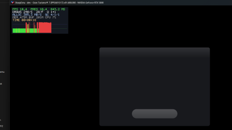
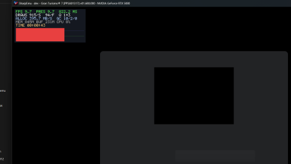
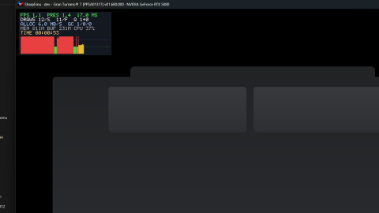
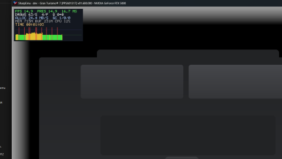
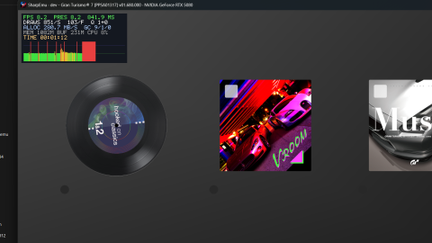
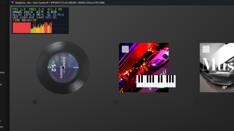

<!--
Copyright (C) 2026 SharpEmu Emulator Project
SPDX-License-Identifier: GPL-2.0-or-later
-->

# SharpEmu

<p align="center">
  
</p>

<p align="center">
  An experimental PlayStation 5 emulator for Windows, Linux and macOS.  
</p>

---

<p align="center">
  <a href="#support">
    
  </a>
</p>

---

## This is purely an AI slop test to see how far GPT/Claude could get. Most of this is likely crap.

## Gran Turismo 7 — Boot Progress

Captured on this branch, in order, from first present through the opening wizard
to the car carousel.

|                                         |                                            |
| :-------------------------------------: | :----------------------------------------: |
|  |   |
|  |     |
|  |  |


## New Debug & Diagnostic Options

> [!NOTE]
> This branch adds **27 new `SHARPEMU_*` environment options**. All are opt-in
> diagnostics — set them in the environment before launching, e.g.
> `$env:SHARPEMU_LOG_PAD = 1` (PowerShell) or `SHARPEMU_LOG_PAD=1` (sh).

<details>
<summary><b>Memory / address space</b></summary>

| Option | Value | What it does |
| --- | --- | --- |
| `SHARPEMU_RESERVE_GUEST_VA` | `1` | Reserves the PS5 guest window in the child process so host allocations can't block guest fixed mappings. |
| `SHARPEMU_GUEST_VA_RESERVATION` | *(internal)* | Carries the promised windows launcher → child. Not set by hand. |
| `SHARPEMU_LOG_SHARED_BACKING` | `1` | Shared direct-memory backing: view maps, partial unmaps, remaps. |
| `SHARPEMU_LOG_PLACEHOLDER` | `1` | Placeholder reserve/split/commit in the guest window. |

</details>

<details>
<summary><b>Breakpoints &amp; watches</b></summary>

| Option | Value | What it does |
| --- | --- | --- |
| `SHARPEMU_WATCH_GUEST_WRITE` | `<hex>[:1\|2\|4\|8]` | Hardware write watch — names the guest RIP that stored there. Takes `[ptr]+off` deref specs. |
| `SHARPEMU_WATCH_GUEST_EXEC` | `<hex>` | Hardware execute breakpoint; answers "does this run, and who calls it" for vtable-reached code. |
| `SHARPEMU_WATCH_GUEST_EXEC_PROBE` | `[rdi+8],[[rdi+8]]+F8` | Deref specs read at each exec hit — resolves a gate flag several hops out in one run instead of a boot per hop. |
| `SHARPEMU_WATCH_GUEST_EXEC_RING` | `=<entries>` | Records every exec hit to a bounded ring, printed only on exception/stall. For hot sites where printing changes timing. |
| `SHARPEMU_BREAK_GUEST_EXEC` | `<hex>[,<hex>…]` | `0xCC` patch, fires once per address then restores. Answers "does this ever run" where debug registers can't. |
| `SHARPEMU_WATCH_GUEST_OBJECT` | `<hex>` | Logs every import handed that guest pointer in any argument register. |

</details>

<details>
<summary><b>Memory inspection</b></summary>

| Option | Value | What it does |
| --- | --- | --- |
| `SHARPEMU_DUMP_GUEST_MEMORY` | `<hex>` or `rbx-0x28[:<hexlen>]` | Dumps bytes at each stall snapshot. Register-relative form handles objects that move every boot. |
| `SHARPEMU_FIND_GUEST_POINTER` | same spec form | One-shot sweep for who holds a pointer. Hits on one thread stack only ⇒ nothing ever registered it. |
| `SHARPEMU_CRASH_DUMP_DIR` | `<path>` | One full-memory minidump from the native-exception handler. Analyse with `cdb -z`. |

</details>

<details>
<summary><b>Sync tracing</b></summary>

| Option | Value | What it does |
| --- | --- | --- |
| `SHARPEMU_TRACE_SYNC_COND` | `<hex>,…` | Condvar addresses → bounded ring of wait/signal/wake/exit, printed only on exception or stall. |
| `SHARPEMU_TRACE_SYNC_SEMA` | `<handle>,…` | Same for semaphore handles. |
| `SHARPEMU_LOG_PTHREAD_COND_SITE` | `<hex retaddr>` | Filter condvar logging by caller return address — traces one wait/signal pair without `LOG_PTHREAD_CONDS` volume. |
| `SHARPEMU_LOG_PTHREAD_COND_WAKE` | `1` | Signalled waiter that can't re-acquire its mutex at wake. Measured 124,525 waiters ⇒ opt-in, not a standing warning. |

</details>

<details>
<summary><b>Graphics</b></summary>

| Option | Value | What it does |
| --- | --- | --- |
| `SHARPEMU_LOG_AGC_LABELS` | `1` | Label writes only (`release_mem`, `write_data`, rewind patch) — shows a cross-queue wait cycle without a full packet trace. |
| `SHARPEMU_TRACE_TEXTURE_BIND_ADDRESS` | `<hex>` | Texture binds in the MiB above it, and which upload path each took. |
| `SHARPEMU_TRACE_MOVIE_TEXTURE` | `<hex>` | Base of the decoded-video ring; logs the whole image-binding group of any draw within 64 MiB, exposing a bad sibling descriptor. |

</details>

<details>
<summary><b>Input / subsystems</b></summary>

| Option | Value | What it does |
| --- | --- | --- |
| `SHARPEMU_AUTO_PAD` | `40:cross,44:right,48:cross` | Holds each button 0.4 s at that second-offset from process start. Any button name. |
| `SHARPEMU_LOG_PAD` | `1` | Pad state and button changes. |
| `SHARPEMU_LOG_FONT` | `1` | Which handles carry parsed outlines, what each glyph render resolved to. |
| `SHARPEMU_LOG_DEVICE_SERVICE` | `1` | DeviceService trace. |
| `SHARPEMU_LOG_IMPORT_CENSUS` | `1` | The distinct set of exports a title actually called. |
| `SHARPEMU_IMPORT_TRACE_DEPTH` | `<n>` | Import ring depth, clamped 64–262144. The call that set a deadlock up is usually well before the one that parked. |
| `SHARPEMU_AVPLAYER_HOLD_BEFORE_CLOSE_MS` | `<ms>` | Temp diagnostic, marked "revert before commit" — keeps the guest file object alive for a live read. |

</details>

---

> [!NOTE]  
> SharpEmu supports Windows x64, Linux x64, and macOS x64. Apple Silicon Macs
> can run the macOS x64 build through Rosetta 2, and Windows on ARM devices
> (e.g. Snapdragon) can run the Windows x64 build through Windows' built-in
> x64 emulation.

> [!WARNING]  
> SharpEmu is an experimental PS5 emulator developed from scratch in C#. The current focus is on accuracy and infrastructure setup rather than game-specific compatibility.

## Info

SharpEmu is an emulator project currently in its early stages of development.

This project is developed purely for research and educational purposes. There are no commercial goals associated with it. We enjoy learning about system architecture and reverse engineering.

SharpEmu focuses exclusively on the PlayStation 5.  
Our goal is **not** to emulate PS4 games, as there is already an excellent emulator dedicated to that platform: **ShadPS4**.

## Games Tested

|               Demons Souls Remake                   |                     Dreaming Sarah                         |
| :-----------------------------------------------------------: | :--------------------------------------------------------------------------------------------: |
|  |  |

|                  Void Terrarium                     |                 Dead Cells                    |
| :------------------------------------------------------------------------: | :------------------------------------------------------------------: |
|  |  |

## Status

The emulator can currently load the `eboot.bin` of real games, execute native CPU instructions, and partially handle kernel-related functionality. However, several critical components are still missing.

Current capabilities include:

* Loading `eboot.bin` and `.elf` files
* Executing native CPU instructions
* Reading basic game metadata (title, version, etc.)
* Loading system modules (`prx` / `sys_module`)
* Partial support for some kernel functions  
* `Fiber` and `AMPR` exports
* PlayGo scenarios
* Initial loading game files
* Shader/resource submits and AGC initial
* Video outputs in some games

Some games have reached like `sceVideoOut` and AGC stages.

SharpEmu supports Windows, Linux, and macOS hosts. Video output uses Vulkan on
Windows and Linux, and MoltenVK on macOS. Platform support is still experimental,
so compatibility and performance vary by game, operating system, and GPU driver.

## Using

Download the release archive for your operating system, extract it, and launch
SharpEmu with the path to a legally obtained game's `eboot.bin`.

Windows PowerShell:

```powershell
.\SharpEmu.exe "C:\path\to\game\eboot.bin" 2>&1 |
  Tee-Object -FilePath "SharpEmu.log"
```

Linux and macOS:

```bash
chmod +x ./SharpEmu

./SharpEmu "/path/to/game/eboot.bin" 2>&1 |
  tee SharpEmu.log
```

A Vulkan-capable GPU and current graphics driver are required. The macOS
release includes the MoltenVK Vulkan implementation.

> [!IMPORTANT]  
> This project does **not** support or condone piracy.  
> All games used during development and testing are dumped from consoles that we personally own.  
> Users are expected to use legally obtained copies of their games.

## Build

1. Install the .NET SDK version specified in [`global.json`](./global.json).
2. Clone the repository: `git clone https://github.com/sharpemu/sharpemu.git`
3. Open the solution file (`SharpEmu.slnx`) in **VSCode**.
4. Build the project: `dotnet build` or `dotnet publish`
5. Build artifacts will be located in the `artifacts` directory.

## Disclaimer

SharpEmu is an experimental emulator intended for research and educational purposes.

This project does not contain any copyrighted system firmware, game data, or proprietary PlayStation assets.

## Special Thanks

The following projects were extremely helpful during development:

* **[ShadPS4](https://github.com/shadps4-emu/shadPS4)**  
Helped with understanding the basic architecture of the PlayStation 4.

* **[Kyty](https://github.com/InoriRus/Kyty)**  
One of the few PS5 emulator projects available and very useful for studying native code execution.

* **Ryujinx**  
Provided valuable references for filesystem handling and low-level C# implementation patterns.

# License

- [**GPL-2.0 license**](https://github.com/sharpemu/sharpemu/blob/main/LICENSE)

## Support

Support SharpEmu via GitHub Sponsors or cryptocurrency. Every contribution helps fund ongoing development and long-term maintenance. GitHub Sponsors is the preferred way to support the project, but cryptocurrency donations are also appreciated.

### ETH/USDT

`0xF315F5d986c790bB3A58DbE60F1B2760997dEd82`

### BTC

`bc1qmr9k8899njys5ny63xsues4jgmkk96erslrkmv`

## Contributing

Before opening an issue or pull request, please read our contribution guidelines:

**[CONTRIBUTING.md](./CONTRIBUTING.md)**

The guide covers:
- Coding style and formatting
- AI-assisted contributions
- Pull request expectations
- Testing guidelines
- Legal and reverse engineering policy
